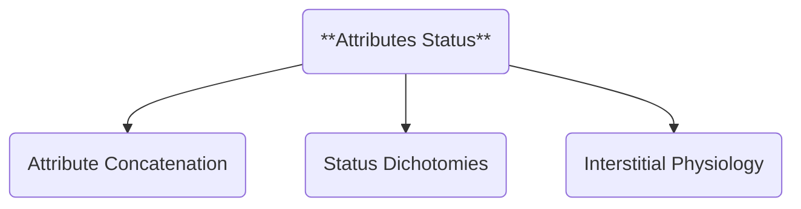

Those who may have found the amount of terminology from the previous chapters tiresome, will be relieved that Part 3 has a lower burden on this respect. But this does not mean that **Attributes Status** is less important. In fact, this section presents a highly contentious set of axioms that require additional focus and development. 

Let's refresh the Attributes Status definition and introducing its components:

- **ATTRIBUTES STATUS**: EIC step that studies the interstitial physiology processes of Behavior Dynamics.

Just like in Attributes Structure, we begin by applying *attribute operators* to *attribute pairs*. But instead of using accentuation *inside* attribute pairs, this time we'll use the **concatenation** operator between attributes of *different* pairs.

| **ATTRIBUTE CONCATENATION** | **SYMBOLIC REPRESENTATION** |
| --- | --- |
| Stillness ^ Simultaneity = Consistency | Q ^ Si = C |
| Movement ^ Successiveness = Impermanence | M ^ Su = I |
| Stillness ^ Successiveness = Balance | Q ^ Su = B |
| Movement ^ Simultaneity = Imbalance | M ^ Si = b |

These crossed interactions between pairs give rise to more sophisticated interstitial qualities. Instead of having a set of four equal concepts that are "enhanced" versions of their primary origin (Stillness --> Pro-Stillness), we now have two new attribute pairs:

- Consistency / Impermanence
- Balance / Imbalance

The first pair is composed by attributes that **reinforce** each other. Successive motion leads to **Impermanence**, as simultaneous serenity leads to **Consistency**. These new attributes attach themselves spontaneously, but this type of pairing is far more unstable than those in the primary jurisdiction. So, any accentuation on one of them is much more impactful and has greater risk of breaking the pair.

The second pair is composed by attributes that **cancel** each other. That is why they create two **interstitial status** rather than identifiable qualities. A **balanced** systemic state depends on remaining still through the passage of time. In contrast, when you have simultaneous elements with different movement dynamics you will create **imbalance**. Is appropriate to clarify that "balance" does not imply "superiority", as there are such contexts that may benefit from imbalance.

With these two attribute pairs established, we can move on to study their interactions. And we'll start to see how this increase in instability gives form to higher interstitial complexity.