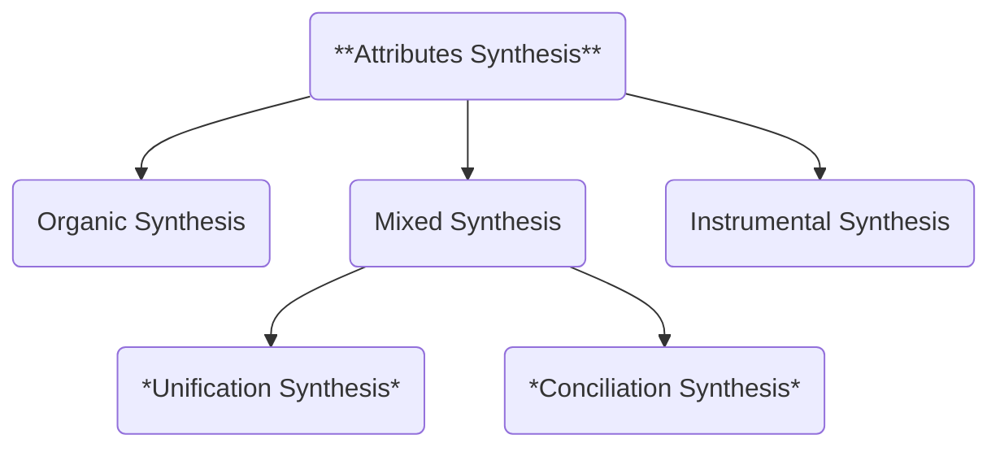

To conclude our EIC exploration, we now integrate Interstitial Anatomy and Physiology. We should remember that the journey between Attributes Proliferation to Attributes Synthesis is just a conceptual one. We are constructing a roadmap to illustrate, step by step, aspects of complex system behavior. Therefore, Attributes Synthesis is not an endpoint or final goal—it represents the outermost layer of interstitiality, constructed upon all previous layers.

Let's refresh the Attributes Synthesis definition and introducing its components:

- **ATTRIBUTES SYNTHESIS**: EIC step that integrates the exploration of attributes structure and status.

These synthesis types—Organic, Instrumental, and Mixed—reflect the core physiological modes previously explored. Their use here indicates how systems ultimately integrate structure and function. You could reformat these synthesis from the anatomy labels, but we think that is more intuitive to separate systemic structures in this way. This classification also anticipates the final bifurcation that emerges specifically within Mixed Synthesis. 
