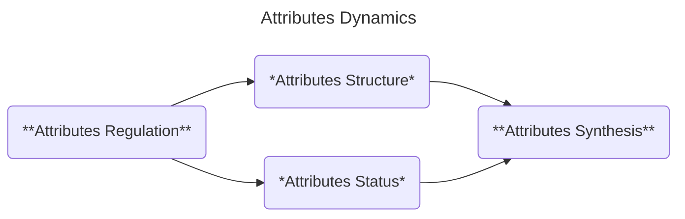

Our discussion on Edified Interstitial Contemplation (or **EIC** for short) starts with the introduction of **Attribute** as our main topic of systemic analysis.

- **ATTRIBUTE**: Specific quality of a system, member or a medium. In this framework, an attribute is not merely a passive trait but a dynamic component that interacts with behavior, structure, and purpose.

Many philosophical frameworks start from scratch with their conceptual foundations. But we already have the building blocks of Behavior Dynamics, which provide us with a congruent structure and tie our framework to the other inventive parcels. That way, any analytical development of EIC can be traced back to the foundational elements of scientific, technological, and artistic explorations.

From here, we need a structure that allows us to explore multiple aspects of the Behavior Dynamics elements, yet can be integrated into a coherent framework. We'll label this model **Attributes Dynamics**. Note that this model is not to be carelessly altered—any revisions must account for their impact on the broader conceptual ecosystem.

- **ATTRIBUTES DYNAMICS**: An EIC model designed to promote analytical exploration and integration of attributes.
- **ATTRIBUTES REGULATION**: EIC step that provides the rule set for the attributes structure and status exploration.
- **ATTRIBUTES STRUCTURE**: EIC step that explores the interstitial anatomy components of Behavior Dynamics.
- **ATTRIBUTES STATUS**: EIC step that studies the interstitial physiology processes of Behavior Dynamics.
- **ATTRIBUTES SYNTHESIS**: EIC step that integrates the exploration of attributes structure and status.

Attributes structure and status have the largest potential for conceptual exploration and implementation, while attributes regulation and synthesis serve as containers to maintain congruence within EIC and with the rest of the inventive parcels. Let's start with the presentation of the first stage of Attributes Dynamics.

