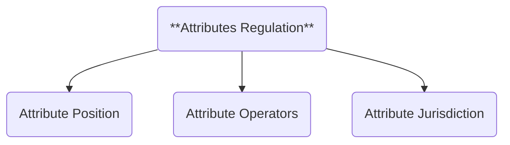

The essence of inventive edification is to proliferate until a beneficial outcome is reached. However, without a way to guide that exploration, the process can easily degenerate. We begin our EIC journey with a concrete analytical regulation to help identify and minimize unproductive or harmful outcomes.

- **ATTRIBUTES REGULATION**: EIC step that provides the rule set to explore the attributes structure and status.

This rule set may be modified or expanded if it serves the purpose of Conciliatorics. While it might be tempting to disregard the upcoming rules, we strongly encourage you to follow them.

