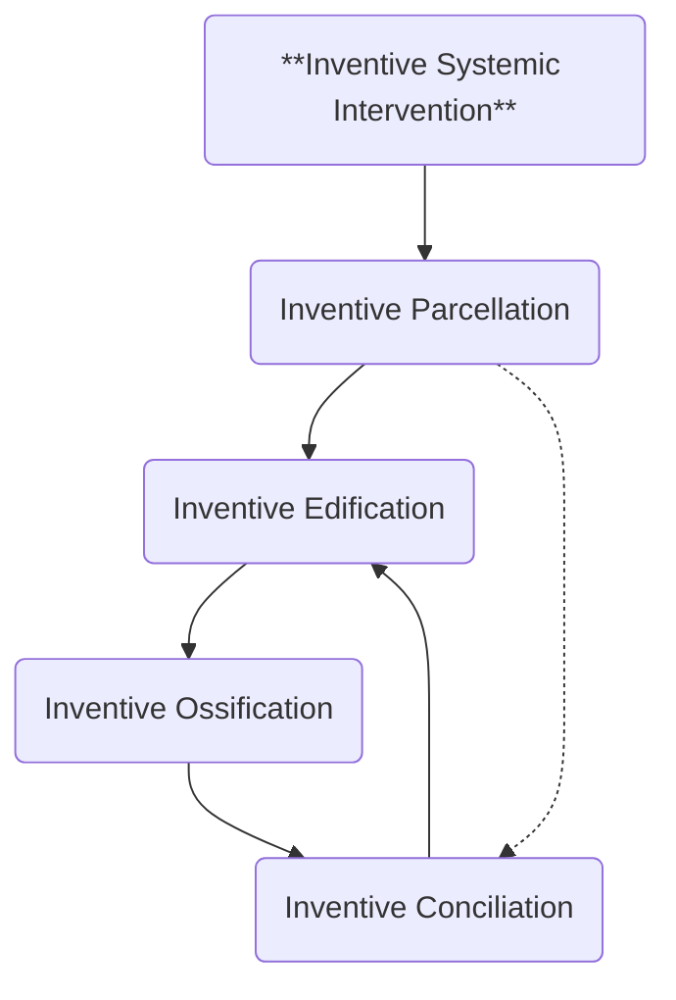

Ossification arises from a fracture in the interaction between inventive parcels. To amend this fracture, we must restore their reciprocal nature and reestablish their collaborative flow.

- **INVENTIVE CONCILIATION**: The restoration of functional processes in inventive edification.

This restoration may take many forms, depending on the context and the nature of the ossification. One such process is what we call the **Parcels Council**—a structured method for facilitating conciliation:

1. **Identify** which inventive parcel corresponds to the ossified intervention. Use the associated fields and ideologies to help pinpoint its identity.
2. **Explore** how the edification's outcome interacts with the other parcels. A valid outcome must be systemically congruent with how each parcel engages Behavior Dynamics.
3. **Observe** friction and disagreements. These are natural and should be noted. But when the outcome of a parcel is blatantly incongruent with the others, that is a strong sign of ossification.
4. **Revise** the edification outcome until sufficient integration is reached. Full harmony isn't required—as long as no parcel is invalidated, the process can move forward.
5. **Maintain** your inventive **focus**, but stay aware of the **periphery**. You can examine the trees through the window, while still holding the forest in mind.
6. **Refine** your inventive **method**, but integrate the rest of the **toolset**. Be the best hammer you can be—while making space for the right tools when you’re not facing a nail.

Even when reconciliation is achieved, it is never final. Edification can ossify again at any moment. Ideally, inventive conciliation should be less a rare event and more a continuous task woven into systemic practice. But the permanent presence of political intrigues, personal ambitions, and identitarian blindness will always raise the risk of ossification.

The complete arrangement of the components involved in inventive intervention can be visualized like this:

This concludes the high-level concepts of Conciliatorics. From here, anyone can explore each component in more depth and delve into the inventive parcels that resonate with their purpose or practice.

<figure style={{ width: '90%', margin: '0 auto', textAlign: 'center' }}>
  
  <figcaption style={{ marginTop: '8px', fontSize: '14px', color: '#666', fontStyle: 'italic' }}>
    <strong>The Parcels Council</strong> - Each inventive parcel brings its own nature and way of knowing.
  </figcaption>
</figure>

In the next chapters, we will turn our focus to **Edified Interstitial Contemplation** and its associated field: Philosophy. We consider this inventive parcel to carry the highest risk of ossification—and therefore the greatest potential for Conciliatorics implementation.

🔖 **End of Part 1** 🔖

