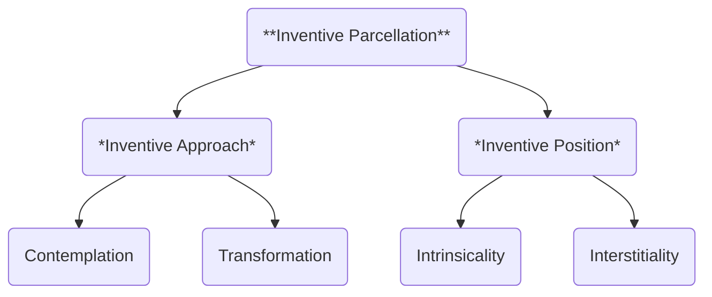

Parcellation refers to the process of breaking down complex intervention behaviors into distinct categories for analysis. There are multiple ways to structure inventive intervention internally, but for Conciliatorics, we focus on **Inventive Parcellation**. We respect and welcome alternative structures, but this one is necessary for the current state of Conciliatorics. Any alternative models must integrate with our primary framework.

- **INVENTIVE PARCELLATION**: Primary structure of inventive intervention.

- **INVENTIVE APPROACH**: Method of inventive intervention.

- **INVENTIVE POSITION**: Focus of inventive intervention.

The main categories for **Inventive Parcellation** are *Inventive Approach* and *Inventive Position*, which respectively define the method and focus of the intervention. In our model, these are not autonomous dynamics: every time an intervener performs inventive intervention, there is a **method and focus** related to that behavior.

The next parcellation is determined by the placement of the intervention's emphasis. Remember, these elements are always expressed within the context of *Behavior Dynamics*: Behavior + Member-Medium-System. While each parcellation has a specific emphasis, the other mandatory elements are still present.

- **CONTEMPLATION**: Inventive approach with emphasis on the *intervener*. Relates to *knowledge building* and *judgement*.

- **TRANSFORMATION**: Inventive approach with emphasis on the *system*. Relates to *concrete change* and *performance*.

- **INTRINSICALITY**: Inventive position with emphasis on the *intervenable*. Relates to *direct engagement* and *inherent properties*.

- **INTERSTITIALITY**: Inventive position with emphasis on the *systemic*. Relates to *intangible outcomes* and *relational properties*.

*Contemplation* and *Transformation* are self-intuitive. Their difference lies in whether the intervener focuses on building knowledge of a specific arrangement of Behavior Dynamics elements, or facilitates a change to reorganize those elements. *Intrinsicality* and *Interstitiality* need further clarification, so we will introduce a thought experiment to explain their relation.

Imagine that you have a *ceramic mug*. You grow attached to that mug, to the point that you call it "your mug". One day you lose that mug, and someone gifts you a *glass mug*. You start using it, but it's not "your mug". **Ceramic** and **glass** are intrinsic properties: they relate to the materials used to make the mug. A mug being **your mug** is an interstitial property: it arises from the emotional attachment you develop over time, and is not inherent to either you or the mug.

An extended analysis of all these four separate elements may be interesting, but because they are never isolated in our model, we will quickly move to integrate them in their final arrangements. We will call these configurations **Inventive Parcels**.

| **INVENTIVE PARCELS** | **Intrinsicality** | **Interstitiality** |
|---|---|---|
| **Contemplation** | Intrinsic Contemplation | Interstitial Contemplation |
| **Transformation** | Intrinsic Transformation | Interstitial Transformation |

These four types of parcels can manifest in both small actions and large endeavors. They can be performed by a single intervener or many, and can develop either in a contained manner or over time. Let's continue our discussion with inventive parcels that progress continuously.