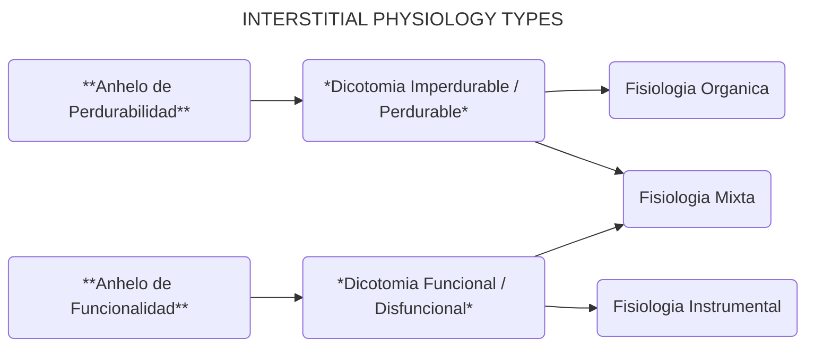

La mayoría de los sistemas complejos son de naturaleza *biológica* o *artificial*. Los sistemas biológicos (desde los microbios hasta los animales inteligentes) evolucionaron con un impulso de supervivencia, al que llamaremos **anhelo de perdurabilidad**. Los sistemas artificiales (desde las herramientas básicas hasta la IA avanzada) se construyen con una ambición de rendimiento, al que llamaremos **anhelo de funcionalidad**. La interacción entre estos anhelos y las dicotomías intersticiales previas crea una estructura especial, denominada **Fisiología Intersticial**.

Esta es la primera vez en nuestro recorrido por la CIE que los conceptos teóricos interactúan directamente con realidades conductuales. Por lo tanto, estas estructuras conllevan implicaciones más amplias y sofisticadas.

- La interacción entre el **anhelo de perdurabilidad** y la **dicotomía Imperdurabilidad / Perdurabilidad** se aborda en la **Fisiología Orgánica**.
- La interacción entre el **anhelo de funcionalidad** y la **dicotomía Funcional / Disfuncional** se aborda en la **Fisiología Instrumental**.

Estos tipos de fisiología son autocontenidos, lo que significa que no tienen acceso a los elementos de la dicotomía opuesta:

- La fisiología orgánica carece de acceso a la dicotomía funcional / disfuncional.
- La fisiología instrumental carece de acceso a la dicotomía imperdurabilidad / perdurabilidad.

Además, estas interacciones son diferentes a las anteriores. Ambos anhelos *modulan* sus respectivas dicotomías, alterando su comportamiento. Esta cualidad de interacción es ajena a las acentuaciones y concatenaciones. Por lo tanto, podemos usar el último operador de nuestro conjunto original: **Modulación** (→). A diferencia de la acentuación o la concatenación, que realzan o combinan atributos, la modulación altera activamente la dinámica interna de un elemento intersticial.

| **ELEMENTO INTERSTICIAL** | **REPRESENTACIÓN SIMBÓLICA** |
|---|---|
| Dicotomía Imperdurabilidad / Perdurabilidad | I≡ ^ I≢ |
| Dicotomía Funcional / Disfuncional | C≡ ^ C≢ |
| Anhelo de Perdurabilidad | I≢L |
| Anhelo de Funcionalidad | C≡L |
| Fisiología Orgánica | oP = I≢L → (I≡ ^ I≢) |
| Fisiología Instrumental | iP = C≡L → (C≡ ^ C≢) |

**Nota Simbólica**: Los símbolos de anhelo heredan su ancla del valor más asociado con su origen sistémico: «I≢» (perdurabilidad) y «C≡» (funcionalidad). El subíndice «L» los distingue como elementos motivacionales más que estructurales.

Si bien la gran mayoría de los sistemas complejos son biológicos o artificiales, existe la posibilidad de un sistema que anhele por igual funcionalidad y perdurabilidad. **La humanidad** es nuestro ejemplo más próximo. Pero, por supuesto, existe potencial para cualquier cantidad de otros sistemas como este: integración futurista de la humanidad + IA, especies extraterrestres desconocidas, etc. Este anhelo simultáneo está contenido en la **Fisiología Mixta**.

| **TIPOS DE FISIOLOGÍA** | **REPRESENTACIÓN SIMBÓLICA** |
|---|---|
| Fisiología Orgánica | oP = I≢L → (I≡ ^ I≢) |
| Fisiología Instrumental | iP = C≡L → (C≡ ^ C≢) |
| Fisiología Mixta | mP = [I≢L → (I≡ ^ I≢)] ^ [C≡L → (C≡ ^ C≢)] |
| Fisiología Mixta (forma corta) | mP = oP ^ iP |

Usaremos el **principio de autodefensa** para ilustrar cómo estos anhelos pueden integrarse. Como sistemas biológicos, nos vemos obligados a actuar para preservar nuestra existencia. En teoría, podríamos matar a cualquier otro ser humano que pudiera representar una amenaza para nuestras vidas; esto estaría **en consonancia** con nuestro anhelo de perdurabilidad. Pero somos colectivamente conscientes de que esta matanza indiscriminada sería disfuncional; por lo tanto, **no estaría en consonancia** con nuestro anhelo de funcionalidad. Por lo tanto, la mayoría de las sociedades humanas acordaron que es válido usar la fuerza para preservar nuestra vida, pero solo como un acto de legítima defensa; nuestros métodos de preservación deben ser congruentes con una ética funcional y un comportamiento moral.

Si bien el principio de legítima defensa goza de un consenso mayoritario, esto no aplica a la gran mayoría de las actividades de la humanidad. Veremos por qué en la siguiente sección.
