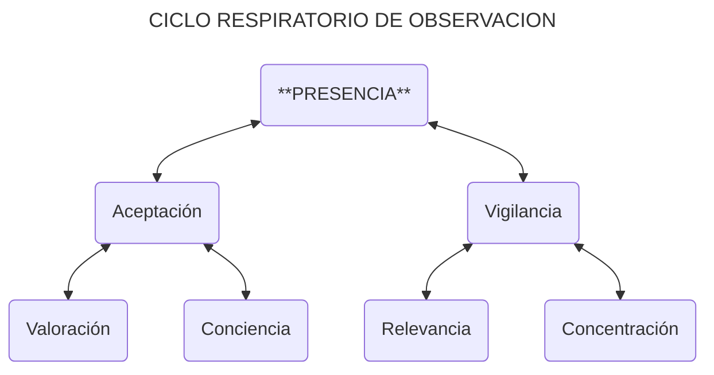

El siguiente elemento de Anatomía Intersticial tiene un inicio similar al anterior. Podemos aplicar los mismos aspectos **confinado**/**no confinado** a la Observación como punto de partida.

- **Observación Confinada**: Juicio
- **Observación No Confinada**: Atención

Nuestros primeros conceptos son **juicio** y **atención**, que corresponden a la observación confinada y no confinada, respectivamente. Al juzgar algo, vinculamos nuestras propias perspectivas, prioridades y sesgos al acto de observar. Si queremos vaciar este juicio, necesitamos prestar atención al mundo como si no fuéramos el sujeto que realiza esa acción.

Las siguientes categorías son mucho más simples y no necesitan un concepto adicional para ser más prácticas. Una observación puede realizarse desde una perspectiva **Top-Down** (de arriba hacia abajo) o **Bottom-Up** (de abajo hacia arriba). Ambos enfoques se complementan: las observaciones de arriba hacia abajo tienden a ser planificadas y globales, mientras que las observaciones de abajo hacia arriba suelen ser espontáneas y específicas. 

El siguiente paso combina cada elemento anterior para crear **formas de observación** concretas:

| **FORMAS DE OBSERVACIÓN** | **Juicio** | **Atención** |
|---|---|---|
| **Top-Down** | Valoración | Conciencia |
| **Bottom-Up** | Relevancia | Concentración |

Al alcanzar una etapa similar con Discernimiento, propagamos aquellos conceptos en hijos de discernimiento separados entre sí. En este nuevo cuadrante, combinaremos estas formas de observación en un tipo condensado llamado **Presencia**.

La **Valoración** es la capacidad de colocarnos como jueces del mundo, determinando lo correcto o incorrecto, lo adecuado o lo inconveniente. Pero también podemos usar la **conciencia** para contemplar el panorama completo sin juzgar. Al integrar la valoración y la conciencia, encontramos la **aceptación** del mundo: el estado de ser capaces de una atención holística y un juicio apropiado.

- Valoración ^ Conciencia = Aceptación

El mundo se expresa constantemente en múltiples manifestaciones. Nos sentimos obligados a asignar un orden de **relevancia** a esas manifestaciones, pero también podemos **concentrarnos** en un aspecto del mundo que escapa a nuestro juicio inmediato. Al integrar la relevancia y la concentración, desarrollamos **vigilancia**: el estado de relevancia disponible y concentración abierta.

- Relevancia ^ Concentración = Vigilancia

Con estas formas integradas de observación, conciliamos las limitaciones de las distinciones iniciales, pero se requiere una integración final. Al consolidar la aceptación y la vigilancia, llegamos a la **presencia**: el estado de observación plena.

- Aceptación ^ Vigilancia = Presencia

El estado de presencia se ve constantemente interrumpido por estímulos internos y externos. Por lo tanto, en lugar de tratar la presencia como un *destino final*, podemos abordarla como un *punto de descanso*: un estado al que siempre podemos regresar, sin presionarnos a permanecer en él perpetuamente. Cuando la presencia se interrumpe, podemos permitir que nuestra observación se desvíe o podemos regresar nuestra consciencia al estado de presencia. Usemos un **ciclo respiratorio de observación** para representar este movimiento constante:

