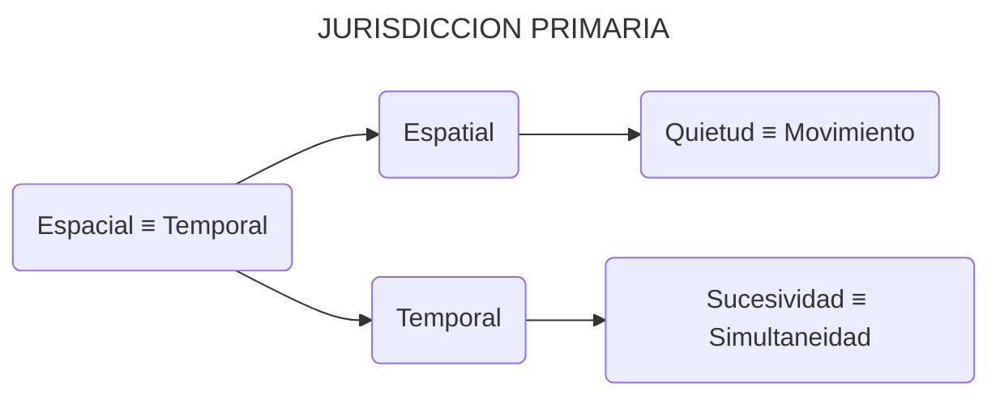

El último concepto fundamental que queremos establecer antes de abrir el análisis es la idea de que cada par de atributos y sus interacciones compuestas **deben tener límites claros**. Para mantener la conciencia de estos límites, asignamos **jurisdicciones** a cada elemento de la Conciliatórica.

- **JURISDICCIÓN SISTÉMICA**: El entorno delimitado que contiene los componentes de la Conciliatórica.

Este concepto enriquece retroactivamente la terminología de capítulos anteriores. Por ejemplo, los cuatro miembros del Consejo de Parcelas operan cada uno dentro de su propia *jurisdicción sistémica*, cuyos límites se definen por la complementariedad entre su abordaje inventivo y su posición inventiva. Ahora extendemos esta terminología también a los componentes de la Dinámica de Atributos:

- **JURISDICCIÓN DE ATRIBUTOS**: El entorno delimitado que contiene los componentes de la Dinámica de Atributos.

El proceso de *osificación inventiva* tiende a erosionar estos límites, a medida que el entorno apropiado de una parcela inventiva comienza a extenderse sobre otras jurisdicciones.

- **INJERENCIA JURISDICCIONAL**: El proceso mediante el cual una jurisdicción trasciende sus límites para ejercer control sobre otras jurisdicciones.

Pero la osificación y la injerencia no son las únicas dinámicas sistémicas que pueden degradar la claridad jurisdiccional. Unos límites jurisdiccionales sanos deben buscar una **diferenciación** adecuada. El deterioro de los límites también puede manifestarse mediante la **disociación** o la **disolución**.

- **DIFERENCIACIÓN JURISDICCIONAL**: El proceso y el estado sistémico en el que se mantienen los límites. La jurisdicción es consciente de su función específica al mismo tiempo que cultiva interacciones sanas; esto promueve la **diplomacia sistémica**.

- **DISOCIACIÓN JURISDICCIONAL**: El proceso y el estado sistémico en el que los límites se fracturan. La jurisdicción se aísla, formando un **silo sistémico**.

- **DISOLUCIÓN JURISDICCIONAL**: El proceso y el estado sistémico en el que los límites se fusionan. La jurisdicción se fusiona con otras, formando una **amalgama sistémica**.

Con nuestro marco jurisdiccional definido, podemos establecer un punto de partida claro para explorar los siguientes conceptos de la CIE:

1. Comenzamos con el par de atributos **espacial** y **temporal**.

2. El atributo espacial se expande al par de atributos **quietud** y **movimiento**.

3. El atributo temporal se expande al par de atributos **sucesividad** y **simultaneidad**.

4. Estos tres pares de atributos están contenidos en la **jurisdicción primaria**.

- **JURISDICCIÓN PRIMARIA**: El entorno inicial de los pares de atributos dentro de la Dinámica de Atributos.

Con nuestra jurisdicción primaria establecida, ahora podemos ampliar nuestro alcance hacia configuraciones de CIE más complejas. Siempre podemos remontarnos a estos conceptos fundamentales para verificar la coherencia interna de nuestra exploración. Y debemos recordar que nuestro objetivo final es alcanzar la síntesis analítica. Este camino está delimitado por dos pilares: un ancla teológica (Regulación de Atributos) y un ancla teleológica (Síntesis de Atributos), lo que nos asegura no deambular sin rumbo por nuestro camino conciliatórico.

🔖 **Fin de la Parte 2** 🔖

