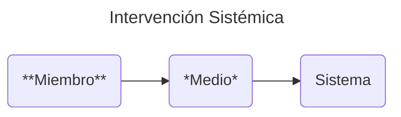
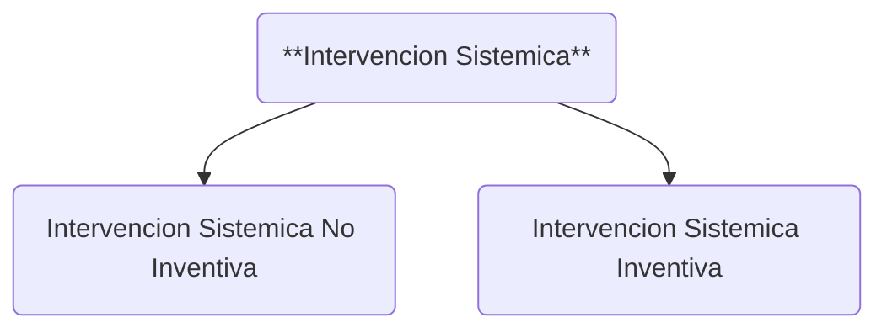
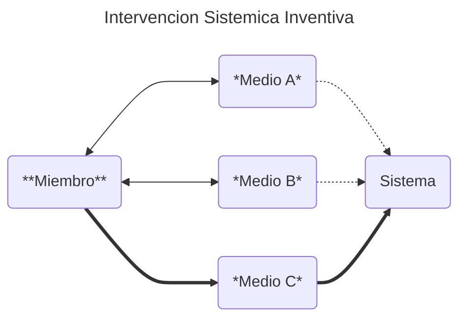

La dinámica del comportamiento da lugar a **varios tipos** de interacciones y configuraciones, una de las cuales es la **intervención sistémica**. Esta interacción es explícitamente jerárquica y se basa en la entidad miembro.

- **INTERVENCIÓN SISTÉMICA**: Acción realizada por un miembro que busca influir en el comportamiento de un sistema.

- **INTERVENTOR**: Miembro que implementa la intervención sistémica en un sistema.

El comportamiento de un miembro puede ser intencional o no intencional, localizado o expansivo, a corto plazo o planificado, etc. La intervención sistémica es intencional, expansiva y planificada. Este comportamiento designa a un miembro como **interventor**. Esta etiqueta no le impide desempeñar otros roles dentro del sistema. El mismo miembro puede tener muchas otras etiquetas de interacción. Los desarrollos teóricos futuros de la Dinámica del Comportamiento introducirán etiquetas de interacción adicionales.

---

De los diferentes subtipos de intervenciones sistémicas, nos centraremos en uno que servirá como base principal de la Conciliatórica: la **Intervención Sistémica Inventiva**. Para simplificar, nos referiremos a este subtipo como **Intervención Inventiva**. Por el momento, cualquier otro subtipo se categorizará como **Intervención Sistémica No Inventiva**, para evitar desviarnos de nuestro enfoque.

- **INTERVENCIÓN SISTÉMICA INVENTIVA**: Exploración del medio de un sistema que busca influir en su comportamiento.

La intervención inventiva se centra en manipular el medio antes de proceder a sus efectos. Esto potencia la intervención sistémica prevista. Mientras el medio se transforma a su estado deseado, el interventor también puede mejorar su destreza. Esto crea un complejo ciclo de retroalimentación entre las tres entidades sistémicas, lo que potencia aún más su comportamiento.

Al añadir múltiples intervinientes a esta retroalimentación, y considerando la dinámica espacial y temporal, se obtiene un comportamiento altamente complejo. Para gestionar eficazmente la intervención inventiva a este nivel analítico, necesitamos una base concisa pero flexible. Por lo tanto, para abordar esta complejidad, la desglosaremos en **parcelas diferenciadas**.

